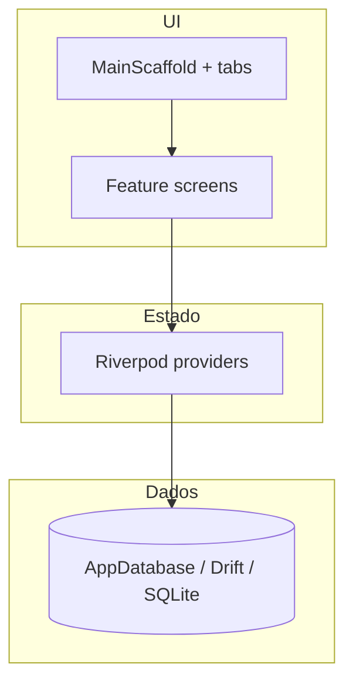

# Caixa Igreja

PDV (ponto de venda) **local**, orientado a **eventos** da igreja: produtos e fichas com stock, vendas com várias formas de pagamento, troco em fichas e registro de vendas. Os dados ficam numa base **SQLite** no dispositivo, via [Drift](https://drift.simonbinder.eu/).

---

## Pré-requisitos

| Ferramenta | Notas |
|------------|--------|
| **Flutter** | Canal estável; compatível com Dart **^3.11.5** (ver `pubspec.yaml`). |
| **Android Studio** / **Xcode** | Para emulador ou dispositivo físico (Android ou iOS). |
| **Git** | Para clonar o repositório. |

Confirme a instalação:

```bash
flutter doctor
```

---

## Setup do projeto

### 1. Clonar e entrar na pasta

```bash
git clone https://github.com/Marcone-Santos1/caixa_igreja.git
cd caixa_igreja
```

### 2. Dependências

```bash
flutter pub get
```

### 3. Código gerado (Drift)

O ficheiro `lib/data/database.g.dart` é **gerado** a partir de `lib/data/database.dart`. Se alterar tabelas, índices ou anotações `@DriftDatabase`, regenere:

```bash
dart run build_runner build --delete-conflicting-outputs
```

Durante desenvolvimento contínuo pode usar:

```bash
dart run build_runner watch --delete-conflicting-outputs
```

> Se o projeto já inclui `database.g.dart` atualizado no repositório, este passo só é obrigatório após mudanças no schema Drift.

### 4. Rodar o app

```bash
flutter run
```

Escolha o dispositivo quando o Flutter pedir (Chrome, macOS, emulador Android, etc.). Para Android/iOS, tenha um emulador ligado ou um telefone em modo desenvolvedor.

### 5. Testes e análise

```bash
flutter test
flutter analyze
```

---

## Configuração por plataforma

### Android

- Nenhum passo extra típico além de ter o SDK Android aceite pelo `flutter doctor`.
- A base SQLite segue o caminho definido por `drift_flutter` (ficheiro `caixa_igreja.sqlite` na pasta de documentos da app).

---

## Estrutura de pastas (`lib/`)

```
lib/
├── main.dart                 # Entrada: prefs, ProviderScope, tema, lock PIN, router
├── app/
│   ├── app_theme.dart        # Tema claro / escuro (Material 3)
│   ├── router.dart           # GoRouter: shell (tabs) + rotas fullscreen do evento
│   └── ui_kit.dart           # Widgets partilhados (lista, empty state)
├── data/
│   ├── database.dart         # Definição Drift, queries e streams
│   ├── database.g.dart       # Gerado (não editar à mão)
│   ├── database_backup.dart  # Exportar / restaurar cópia SQLite
│   ├── drift_database_paths.dart
│   └── sale_line_draft.dart
├── domain/                   # Regras e constantes sem UI (pagamentos, stock, tipos de linha)
├── features/                 # Ecrãs por funcionalidade (feature-first)
│   ├── events/               # Lista de eventos, hub, vendas, fichas, troco…
│   ├── products/
│   ├── export/               # CSV de vendas
│   ├── settings/           # Configurações, aparência, segurança (PIN)
│   ├── security/             # Lock screen
│   └── shell/                # Scaffold com barra inferior (tabs)
├── providers/                # Riverpod: base de dados, eventos, financeiro, PIN, tema…
└── utils/                    # Formatação de dinheiro, datas, lógica de troco em fichas
```

Pastas de topo do repositório: `android/`, `ios/`, `macos/`, `test/`, etc., geridas pelo Flutter.

---

## Arquitetura

### Visão geral

A app segue um modelo **feature-first**: cada área (eventos, produtos, exportar, configurações) tem os seus widgets sob `lib/features/`. O estado partilhado e o acesso à base de dados concentram-se em **providers** Riverpod; a navegação é **declarativa** com **go_router**.



### Riverpod

- `ProviderScope` em `main.dart` envolve a app; `sharedPreferencesProvider` é sobrescrito com a instância obtida no arranque.
- `appDatabaseProvider` expõe uma única instância de `AppDatabase` por scope, com `close` no `dispose` do provider.
- Providers `StreamProvider` / `FutureProvider` (por exemplo resumo financeiro, stock baixo) leem a base e reconstroem a UI quando os dados mudam.
- PIN e tema usam `StateNotifier` / `StateProvider` e `SharedPreferences` para persistência simples.

### GoRouter

- **StatefulShellRoute** com três ramos: **Eventos** (`/events`), **Exportar** (`/export`), **Configurações** (`/settings`). Cada ramo mantém o seu próprio stack interno ao mudar de tab.
- Rotas **fullscreen** com `parentNavigatorKey` raiz: hub do evento, PDV, produtos, fichas, registo de vendas, troco em fichas, segurança/aparência (por cima do shell).

### Drift (persistência)

- Tabelas definidas em `database.dart` (eventos, produtos, fichas, vendas, linhas, alocações de troco).
- Migrações em `migration.onUpgrade`; `schemaVersion` incrementado quando o schema muda.
- Ligação nativa via `drift_flutter` (`driftDatabase(name: 'caixa_igreja')`), alinhada com `drift_database_paths.dart` para backup/cópia do ficheiro `.sqlite`.

### Domínio e utilitários

- `lib/domain/` — códigos estáveis (ex.: `PaymentMethod`, `SaleLineKind`, limiar de stock) usados pela BD e pela UI sem depender de Flutter.
- `lib/utils/` — formatação e cálculos reutilizáveis.

### Temas e acessibilidade

- `caixaIgrejaTheme()` e `caixaIgrejaThemeDark()` centralizam cor, tipografia (Google Fonts) e componentes M3; o modo é escolhido em **Configurações → Aparência** e persiste em prefs.

---

## Funcionalidades principais (referência rápida)

| Área | Descrição |
|------|-----------|
| **Eventos** | CRUD de eventos; hub com resumo financeiro e alertas de stock baixo. |
| **Vendas** | Fluxo de nova venda, troco, fichas como troco. |
| **Exportar** | CSV das linhas de venda por evento (partilha). |
| **Configurações** | PIN no arranque, tema claro/escuro/sistema, backup e restauro da base SQLite. |

---

## Licença e contribuição

Este repositório está configurado como `publish_to: 'none'` (uso interno / projecto próprio). Para contribuir, use branches e pull requests alinhados com o `flutter analyze` e `flutter test` sem erros.
