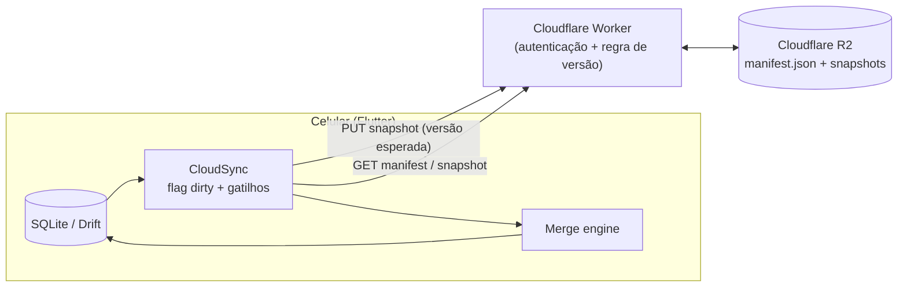
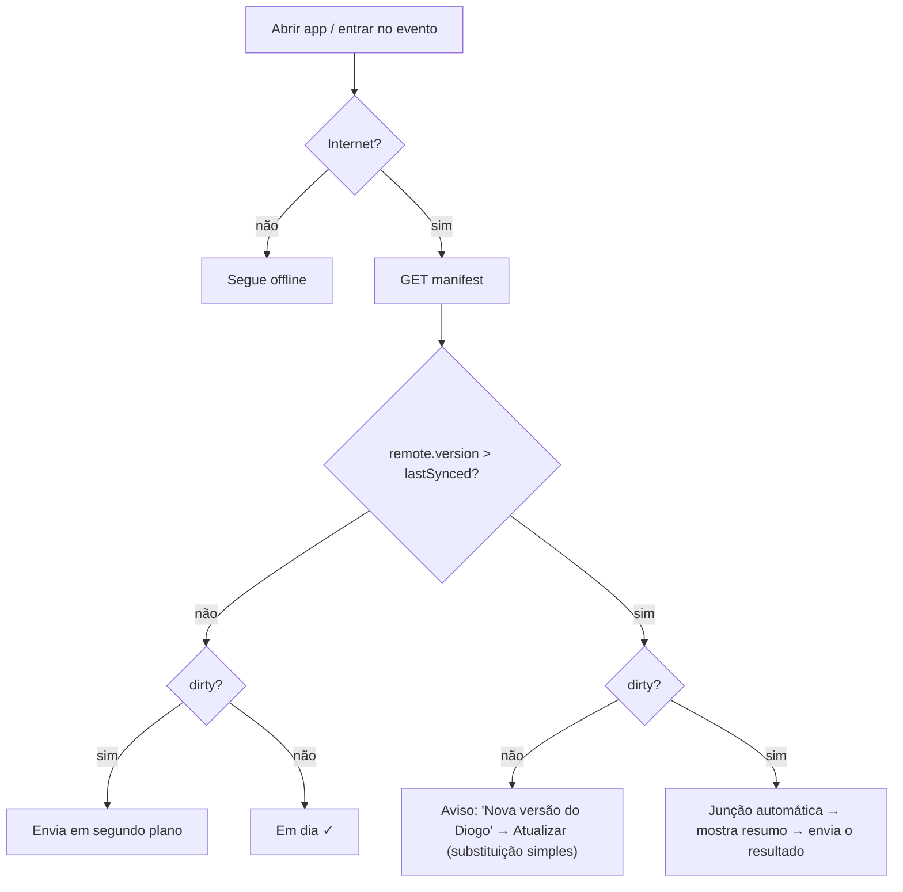

# RFC — Passagem de caixa entre celulares (sincronização pela nuvem)

> **Status:** Aprovada com mudanças (revisão D2); transporte substituído
> pela RFC v2 (por evento) — `rfc_sincronizacao_nuvem_v2_por_evento.md`
> **Revisão:** `rfc_sincronizacao_nuvem_revisao.md` · **Implementação:** `sincronizacao_nuvem.md`
> **App:** Cantina Padroeira (Flutter + Drift/SQLite, Android/iOS)
> **Autor:** Marcone · **Data:** 04/10/2026

---

## 1. Contexto

O **Cantina Padroeira** é um PDV mobile usado na cantina da igreja em dias de evento ou culto. Ele cadastra eventos, produtos, combos e fichas, registra vendas (dinheiro, PIX, cartão), controla troco e estoque, abre e fecha sessões de caixa e imprime fichas numa impressora térmica Bluetooth.

Hoje **todos os dados ficam só no celular**, num arquivo SQLite (Drift). Já existe:
- **Exportar e importar o banco** (`.sqlite`) manualmente, via compartilhamento do sistema
- **Sincronização local por Wi-Fi** (host/cliente): vários celulares vendem **ao mesmo tempo, no mesmo evento**, e um deles é o servidor (veja `docs/sincronizacao_local.md`)

---

## 2. Problema raiz

**O responsável pelo caixa muda de um dia de venda para outro, mas os dados ficam presos no celular de quem operou por último.**

Exemplo real:
- **Semana 1:** o Marcone opera o caixa no celular dele.
- **Semana 2:** quem opera é o Diogo. O Marcone precisa **exportar o banco, mandar o arquivo** (WhatsApp, por exemplo) e o Diogo **importa** no celular dele.
- **Semana 3:** volta para o Marcone. Agora é o Diogo quem precisa mandar o arquivo.

### Por que isso é ruim
| Dor | Consequência |
|---|---|
| Processo manual a cada troca | Fácil de esquecer, principalmente na correria antes do evento |
| Depende de quem operou antes estar disponível | Se o Diogo não mandar o arquivo, o Marcone começa com dados velhos |
| Não há noção de "versão mais nova" | É possível importar um arquivo antigo e **perder vendas** sem perceber |
| Não há cópia de segurança | Se o celular quebrar ou for perdido, o histórico vai junto |
| Dois celulares podem começar com bases diferentes | Estoque, relatórios e fechamentos inconsistentes |

### O que **não** é o problema
- Vários caixas vendendo **ao mesmo tempo no mesmo dia**: a sincronização por Wi-Fi já resolve.
- Acompanhar vendas em tempo real de casa: seria bom, mas não é o foco agora.

---

## 3. Necessidades

### Funcionais
1. **N1. Envio automático:** quem operou envia os dados para a nuvem sem ação manual, **mesmo que só tenha internet depois** (fila: envia quando houver conexão).
2. **N2. Aviso de versão mais nova:** ao abrir o app ou entrar no evento, avisar se existe uma versão mais recente na nuvem, de quem e de quando ("Diogo · hoje 14:58 · 312 vendas").
3. **N3. Atualização segura:** baixar a versão da nuvem **sem perder nada local** (sempre guardar uma cópia antes).
4. **N4. Conflito tratado:** se os dois celulares tiverem dados novos, **juntar automaticamente** o que der e nunca sobrescrever em silêncio.
5. **N5. Histórico:** manter versões anteriores para poder voltar se algo der errado.
6. **N6. Funciona offline:** o app continua 100% funcional sem internet. A nuvem só sincroniza.

### Não funcionais / restrições
- **Simples e barato:** de preferência no plano gratuito, sem montar um backend completo.
- **Sem Supabase/Firebase por enquanto:** a preferência é **Cloudflare R2** (armazenamento de objetos).
- **Seguro o bastante:** a chave de escrita no armazenamento não pode estar exposta dentro do APK.
- **Pouco atrito para os usuários:** configurar uma vez (código da igreja ou QR) e esquecer.
- **Volume pequeno:** algumas centenas de vendas por evento. O banco tem poucos MB e fica bem menor compactado.

---

## 4. Estado atual do código (relevante para a decisão)

| Aspecto | Situação | Impacto |
|---|---|---|
| IDs | **UUID texto** em todas as tabelas | ✅ Dois celulares nunca geram o mesmo ID, o que permite juntar dados |
| Vendas (`sales`, `sale_lines`) | Criadas na venda, **mas podem ser editadas** (`updateSaleWithLines` apaga as linhas, devolve o estoque e grava de novo) | ⚠️ Não são só acréscimos. É preciso saber qual edição é a mais nova. |
| Estoque | **Contador que é sobrescrito** (`products.stockQty`, `event_dot_denominations.stockQty`), descontado na venda e devolvido na edição | ⚠️ Juntar contadores de dois celulares dá resultado errado |
| Datas de alteração | **Não existem** `updatedAt` nem `deletedAt` nas tabelas | ⚠️ Impossível saber "quem é mais novo" ou "foi apagado" sem mudar o schema |
| Schema | Drift `schemaVersion = 8`, com migrações | Versões diferentes do app precisam ser tratadas |
| Backup | `lib/data/database_backup.dart` já exporta e restaura o `.sqlite` | ✅ Dá para reaproveitar |

Tabelas: `events`, `event_dot_denominations`, `products`, `product_combo_items`, `cash_sessions`, `sales`, `sale_lines`, `sale_change_dot_allocations`.

---

## 5. Soluções consideradas

### Opção A — Backend completo (Supabase / Firebase)
Banco na nuvem como fonte da verdade, com sincronização incremental e login.
- ✅ Robusto, tempo real, consultas no servidor
- ❌ Mais complexidade (login, regras de acesso, mapeamento Drift ↔ nuvem), dependência de terceiros e mais código
- **Descartada por enquanto** (restrição explícita)

### Opção B — Passagem por Wi-Fi local
Reaproveitar o servidor local: quem operou antes abre "transferir" e o outro puxa o banco.
- ✅ Sem nuvem, custo zero, reaproveita código
- ❌ **Os dois celulares precisam estar juntos.** Não resolve a dor de "quem operou antes não está aqui".
- **Descartada** como solução principal

### Opção C — Cópias do banco no R2 só com "a última vence"
Enviar o `.sqlite` inteiro e baixar o mais novo.
- ✅ Muito simples
- ❌ Se os dois celulares tiverem dados novos, **um apaga o outro** (perda de vendas)
- **Insuficiente sozinha**

### Opção D — Cópias no R2 + versionamento + junção automática ⭐ (proposta)
Enviar o `.sqlite` inteiro e versionado para o R2, detectar divergência pelo número da versão e, quando houver, **juntar automaticamente** as duas bases linha a linha, aproveitando os UUIDs e colunas novas de controle.
- ✅ Atende N1–N6
- ✅ Só armazenamento de objetos + um Worker pequeno. Sem banco no servidor.
- ⚠️ Exige mudar o schema (`updatedAt`, `deletedAt`) e repensar o estoque
- Detalhada abaixo

---

## 6. Proposta detalhada (Opção D)

### 6.1 Arquitetura



### 6.2 Como fica no R2
```
{codigoIgreja}/
  manifest.json              ← ponteiro para a versão atual
  snapshots/
    v000042.sqlite.gz
    v000043.sqlite.gz        ← últimas N versões (ex.: 20)
```
`manifest.json`:
```json
{
  "version": 43,
  "file": "snapshots/v000043.sqlite.gz",
  "sha256": "…",
  "schemaVersion": 9,
  "uploadedAt": "2026-10-04T15:20:00Z",
  "deviceId": "b1f3…",
  "deviceName": "Celular do Diogo",
  "baseVersion": 42,
  "summary": { "events": 3, "sales": 312, "lastSaleAt": "2026-10-04T14:58:00Z" }
}
```

### 6.3 Mudanças no schema (migração v8 → v9)
Em **todas** as tabelas:
- `updatedAtMs INTEGER NOT NULL`: atualizado a cada insert ou update
- `deletedAtMs INTEGER NULL`: **exclusão lógica** (marca como apagado em vez de dar `DELETE`)
- `updatedByDevice TEXT`: qual celular fez a última alteração (para auditoria e desempate)

As consultas da UI passam a filtrar `deletedAtMs IS NULL`.

**Estoque:** duas alternativas para a revisão escolher.
- **(E1) Movimentações de estoque:** nova tabela `stock_movements(id, itemId, delta, reason, saleId?, atMs, deviceId)`. O saldo é a **soma** das movimentações, e a coluna `stockQty` vira um cache recalculado. Na junção, basta unir as movimentações (UUIDs) e recalcular. *Mais correto.*
- **(E2) Recalcular a partir das vendas:** guardar `initialStockQty` no produto ou ficha. O saldo é o inicial, mais os ajustes manuais, menos o vendido. Recalcula depois da junção. *Mais simples, mas ajustes manuais precisam de um registro próprio.*

### 6.4 Estado local
| Chave | Uso |
|---|---|
| `deviceId` / `deviceName` | Identificação do celular |
| `cloud.lastSyncedVersion` | Última versão da nuvem que este celular conhece |
| `cloud.dirty` | Houve gravação depois do último envio (via `db.tableUpdates()`) |

### 6.5 Envio (a "fila")
É uma **flag de envio pendente**: sempre se manda o banco inteiro.

**Gatilhos:** fechar a sessão de caixa · ~3 min depois da última venda · voltar a ter internet · abrir ou retomar o app · botão manual.

**Passos:**
1. `GET manifest`. Se `remote.version > lastSyncedVersion`, **fazer a junção antes** (6.7).
2. `VACUUM INTO` para gerar uma cópia consistente, depois gzip e sha256.
3. `PUT /snapshot?expected=N` no Worker. Ele grava `v{N+1}` e atualiza o manifest **somente se** a versão atual ainda for `N` (escrita condicional por ETag no R2).
4. Se der certo: `lastSyncedVersion = N+1`, `dirty = false`.
5. Se der `409` (outro celular enviou no meio): volta ao passo 1.
6. Se não houver rede: continua `dirty` e tenta no próximo gatilho.

### 6.6 Ao abrir o app ou entrar num evento


### 6.7 Junção automática
Executada localmente, com o banco remoto anexado por `ATTACH DATABASE`:

1. **Cópia de segurança** do banco local em `backups/pre-merge-{data}.sqlite`.
2. Para cada tabela, na ordem das dependências (`events` → `denominations`/`products` → `combo_items` → `cash_sessions` → `sales` → `sale_lines` → `allocations` → `stock_movements`):
   - Linha **só no remoto**: insere.
   - Linha **nos dois**: fica a que tiver **maior `updatedAtMs`**. Em empate, desempata por `deviceId`. Exclusões lógicas também são alterações, então propagam.
3. **Vendas editadas:** a venda e suas linhas são tratadas **como um bloco**. Vence a versão da venda com maior `updatedAtMs`, e as linhas seguem essa versão.
4. **Estoque:** recalculado depois da junção (E1 ou E2). **Nunca se juntam contadores.**
5. **Sessões de caixa:** a união resolve, porque cada celular abre a sua. Uma sessão fechada vence a aberta, já que o fechamento tem `updatedAtMs` maior.
6. Mostrar um **resumo**: "+45 vendas do Diogo, 2 produtos atualizados, 0 conflitos".
7. Enviar o resultado como `v{N+1}`.

**Limites conhecidos:**
- Se os dois celulares editarem **a mesma venda ou o mesmo produto**, vence a edição mais recente e a outra se perde (fica na cópia de segurança).
- Depende de os relógios dos celulares estarem razoavelmente certos (NTP do sistema). Diferenças de minutos são toleráveis no revezamento.

### 6.8 Restauração simples (sem dados locais novos)
Baixar e conferir o sha256 → checar `schemaVersion` (se o remoto for maior que o local: *"atualize o app"*) → copiar o local para `backups/` → trocar o arquivo → reabrir o banco.

### 6.9 Segurança
- **Não** embutir a chave S3 do R2 no app: quem extraísse do APK poderia apagar tudo.
- **Cloudflare Worker** (plano gratuito, ~60–100 linhas) com acesso ao R2 por binding:
  - `GET /manifest`, `GET /snapshot/:v`, `PUT /snapshot?expected=N`
  - Autenticação por **código da igreja + segredo** configurados uma vez (digitados ou por QR)
  - Aplica a regra de versão `N → N+1` no servidor e apaga as versões além de N
- Os dados são de uma cantina (sem dados sensíveis de clientes além do nome opcional). O risco é baixo, mas a integridade importa.

### 6.10 Custos
O R2 gratuito tem 10 GB de armazenamento, 1 milhão de escritas e 10 milhões de leituras por mês, e saída grátis. O Worker gratuito tem 100 mil requisições por dia. O uso previsto fica **muito abaixo** disso, então o custo esperado é **zero**.

---

## 7. Plano de implementação (alto nível)

| Fase | Entrega |
|---|---|
| **1. Schema** | Migração v9: `updatedAtMs`, `deletedAtMs`, `updatedByDevice`, exclusão lógica, estoque (E1 ou E2), ajuste das consultas |
| **2. Worker** | `cloud/worker/` + `wrangler.toml`, bucket R2, segredo da igreja |
| **3. Envio** | `CloudBackupService` (HTTP), `CloudSyncProvider` (dirty, gatilhos, debounce, conectividade), `VACUUM INTO` + gzip |
| **4. Download e restauração** | Verificação do manifest, aviso na UI, restauração com cópia de segurança, reabertura do banco |
| **5. Junção** | Motor de junção com `ATTACH`, recálculo de estoque, resumo |
| **6. UI** | Tela "Backup na nuvem" (configuração, status, enviar agora, histórico, restaurar versão), indicador ☁️ no hub do evento |
| **7. Testes** | Testes unitários da junção (cenários abaixo) + teste manual com 2 emuladores |

### Cenários de teste da junção
1. Só A vendeu → B substitui (sem junção)
2. A e B venderam itens diferentes offline → união, estoque correto
3. A editou a venda X, B não → vale a edição de A
4. A e B editaram a mesma venda → vence a mais recente
5. A apagou o produto P, B vendeu P → a exclusão lógica preserva as vendas, e o produto fica marcado como apagado
6. Versões de schema diferentes → bloqueio com mensagem
7. Envio interrompido no meio → manifest intacto, nova tentativa funciona

---

## 8. Perguntas para o revisor

1. A **Opção D** (cópias + junção) faz sentido, ou a complexidade da junção justifica ir direto para um backend (Opção A)?
2. **Estoque:** E1 (movimentações) ou E2 (recalcular a partir das vendas)?
3. **Cloudflare Worker** é aceitável, ou prefere outra forma de proteger o acesso ao R2?
4. "A edição mais recente vence" pelo relógio do celular é suficiente para o nosso uso, ou vale usar um relógio lógico (contador por celular)?
5. **Banco inteiro** numa cópia só, ou **uma cópia por evento**?
6. Quando não há dados locais novos, **atualizar automaticamente** ou sempre perguntar?
7. Quantas versões manter no histórico?
8. Algum cenário de uso real que não foi coberto?
